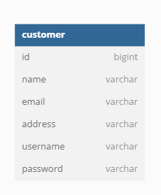
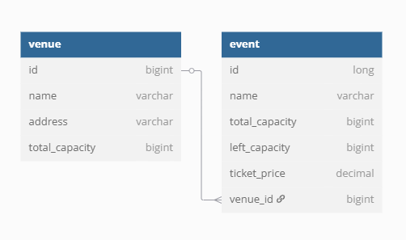
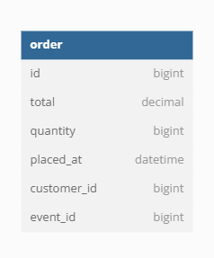

# Analysis and Design — Business Process Automation Solution

> **Goal:** Analyze the online ticket booking business process and design a service-oriented automation solution (SOA/Microservices). Scope: Focus on the ticket booking process — from event discovery to order confirmation.
>
> **References:**
> 1. *Service-Oriented Architecture: Analysis and Design for Services and Microservices* — Thomas Erl (2nd Edition)
> 2. *Microservices Patterns: With Examples in Java* — Chris Richardson
> 3. Bài tập — Phát triển phần mềm hướng dịch vụ — Hung Dang

---

## Part 1 — Analysis Preparation

### 1.1 Business Process Definition

- **Domain:** Entertainment / Event Management
- **Business Process:** Online Ticket Booking (ĐặtVéSựKiện) — Người dùng tìm kiếm sự kiện, chọn số vé và hoàn tất đặt vé.
- **Actors:**
  - **Customer (Người dùng):** Tìm kiếm, chọn sự kiện và đặt vé.
  - **API Gateway:** Điểm vào duy nhất, xác thực JWT và định tuyến request.
  - **Auth Service (Utility):** Cấp phát và xác thực JWT token.
  - **Inventory Service (Entity Service):** Quản lý thông tin địa điểm và sự kiện, kiểm tra và cập nhật số lượng vé.
  - **Booking Service (Task Service):** Điều phối quy trình đặt vé — kiểm tra tồn kho, phát sinh sự kiện lên Kafka.
  - **Order Service (Entity Service):** Lưu trữ và truy vấn lịch sử đặt vé của khách hàng.
- **Scope:** Từ khi người dùng gửi yêu cầu đặt vé đến khi đơn hàng được lưu thành công hoặc trả về lỗi khi không đủ vé.

**Process Flow (simplified):**

```
Customer --[POST /api/v1/booking]--> API Gateway
  --> Validate JWT (Auth Service)
  --> Route to Booking Service
      --> Check & Reserve Tickets (Inventory Service)
      --> Publish booking event to Kafka topic "booking"
          --> Order Service consumes event --> Save Order
```

---

### 1.2 Existing Automation Systems

| System | Role | Notes |
|--------|------|-------|
| None   | N/A  | Quy trình được thiết kế và triển khai mới hoàn toàn. Không có hệ thống kế thừa. |

> "None — the process is currently performed manually."

---

### 1.3 Non-Functional Requirements

Non-functional requirements serve as input for identifying Utility Service and Microservice Candidates in step 2.7.

| Category      | Requirement |
|---------------|-------------|
| Performance   | 95% request đặt vé phản hồi dưới 2 giây ở giờ cao điểm. Load-balanced routing qua Eureka + Spring Cloud Gateway. |
| Security      | Bắt buộc xác thực JWT tại Gateway cho mọi route nghiệp vụ (`/api/v1/inventory/**`, `/api/v1/booking/**`, `/api/v1/orders/**`). Không hardcode thông tin nhạy cảm trong source code. |
| Scalability   | Mỗi service có thể scale độc lập (horizontal scaling). Eureka tự động phát hiện instance mới. |
| Availability  | Tất cả service expose `GET /health`. Booking và Inventory sử dụng Kafka để tách biệt ghi đơn hàng (async), tránh mất đơn khi Order Service tạm thời không khả dụng. |

---

## Part 2 — REST/Microservices Modeling

### 2.1 Decompose Business Process & 2.2 Filter Unsuitable Actions

Decompose the ĐặtVéSựKiện process into granular actions:

| # | Action | Actor | Description | Suitable? |
|---|--------|-------|-------------|-----------|
| 1 | Đăng nhập hệ thống | Customer | Gửi username/password, nhận JWT | ✅ |
| 2 | Xem danh sách sự kiện | Customer | Tìm kiếm venue/event theo tên | ✅ |
| 3 | Xem chi tiết sự kiện | Customer | Xem thông tin sự kiện, giá vé, số vé còn | ✅ |
| 4 | Xác thực token tại Gateway | Gateway | Gọi Auth Service validate JWT trước khi route | ✅ |
| 5 | Gửi yêu cầu đặt vé | Customer | POST booking request với eventId + số vé | ✅ |
| 6 | Kiểm tra số vé còn lại | Booking Service | Gọi Inventory Service kiểm tra capacity | ✅ |
| 7 | Trừ số vé từ tồn kho | Inventory Service | Cập nhật capacity sau khi xác nhận | ✅ |
| 8 | Tính tổng tiền | Booking Service | Tính ticketCount × ticketPrice | ✅ |
| 9 | Phát sự kiện đặt vé lên Kafka | Booking Service | Publish message vào topic `booking` | ✅ |
| 10 | Lưu đơn hàng vào DB | Order Service | Consume Kafka message, persist order | ✅ |
| 11 | Xem lịch sử đặt vé | Customer | GET orders by username | ✅ |
| 12 | Quản trị viên định nghĩa sự kiện | Admin (manual) | Dữ liệu seed/init — không tự động trong luồng | ❌ |

> Actions marked ❌: thao tác quản trị thủ công, không nằm trong luồng tự động của MVP.

---

### 2.3 Entity Service Candidates

Identify business entities and group reusable (agnostic) actions:

| Entity Service Candidate | Entities | Agnostic Actions |
|--------------------------|----------|-----------------|
| **Inventory Service** | `Venue`, `Event` | Lấy danh sách venue+event theo bộ lọc; Kiểm tra capacity event; Trừ số vé khi đặt thành công |
| **Order Service** | `Order` | Lưu đơn hàng mới (từ Kafka); Lấy danh sách đơn hàng theo username |

---

### 2.4 Task Service Candidate

Group process-specific (non-agnostic) actions:

| Task Service Candidate | Non-agnostic Actions |
|------------------------|---------------------|
| **Booking Service** | Nhận yêu cầu đặt vé của khách; Gọi Inventory Service kiểm tra & trừ vé; Tính tổng tiền; Publish message Kafka `booking` |

---

### 2.5 Identify Resources

Map entities/processes to REST URI Resources:

| Resource | URI |
|----------|-----|
| Authentication | `/api/v1/auth` |
| Venues & Events | `/api/v1/inventory/venues` |
| Event Inventory | `/api/v1/inventory/event/{eventId}` |
| Booking (task) | `/api/v1/booking` |
| Orders | `/api/v1/orders/customer/{username}` |
| Health Check | `/health` (all services) |

---

### 2.6 Associate Capabilities with Resources and Methods

| Resource | Method | Capability | Status Codes |
|----------|--------|-----------|--------------|
| `/api/v1/auth/login` | POST | Đăng nhập, nhận access + refresh token | 200, 401 |
| `/api/v1/auth/refresh` | POST | Làm mới access token | 200, 401 |
| `/api/v1/auth/validate` | GET | Validate JWT (dùng bởi Gateway) | 200, 401 |
| `/api/v1/inventory/venues` | GET | Lấy danh sách venue + events (có filter) | 200 |
| `/api/v1/inventory/event/{eventId}` | POST | Kiểm tra & trừ vé cho event | 200, 400 |
| `/api/v1/booking` | POST | Tạo yêu cầu đặt vé (Task) | 200, 400 |
| `/api/v1/orders/customer/{username}` | GET | Lấy lịch sử đặt vé theo username | 200 |
| `/health` | GET | Kiểm tra trạng thái service | 200 |

---

### 2.7 Utility Service & Microservice Candidates

Based on Non-Functional Requirements (1.3) and Processing Requirements:

| Candidate | Type | Justification |
|-----------|------|---------------|
| **Auth Service** | Utility Service | Cross-cutting concern — xác thực token với mọi request nghiệp vụ. Tái sử dụng bởi Gateway cho tất cả backend routes. |
| **Eureka Server** | Infrastructure Utility | Cross-cutting — đăng ký và khám phá service. Cho phép Gateway load-balance mà không hardcode địa chỉ. |
| **API Gateway** | Infrastructure Microservice | Điểm kiểm soát truy cập duy nhất, thực thi security policy (AuthenticationFilter), routing. |
| **Booking Service** | Microservice (Task) | Xử lý cao tải đặt vé độc lập; cần scale theo lượng request; tách biệt logic điều phối khỏi lưu trữ. |
| **Kafka** | Messaging Infrastructure | Đảm bảo Availability: tách biệt Booking Service (produce) và Order Service (consume), chống mất đơn khi Order Service tạm ngừng. |

---

### 2.8 Service Composition Candidates

Interaction diagram — how services collaborate to fulfill ĐặtVéSựKiện:

```
┌──────────┐   JWT+Request   ┌─────────────┐  validate token  ┌──────────────┐
│ Customer │ ─────────────► │ API Gateway │ ───────────────► │ Auth Service │
└──────────┘                 └──────┬──────┘                  └──────────────┘
                                    │ route (authenticated)
                                    ▼
                             ┌──────────────────┐
                             │  Booking Service │
                             └────────┬─────────┘
                          check/book  │              publish
                          tickets     │         ┌─────────────────┐
                                      │         │      Kafka      │
                    ┌─────────────────▼──┐      │  topic:booking  │
                    │  Inventory Service │      └────────┬────────┘
                    └────────────────────┘               │ consume
                                                         ▼
                                                  ┌──────────────┐
                                                  │ Order Service│
                                                  └──────────────┘
```

---

## Part 3 — Service-Oriented Design

### 3.1 Uniform Contract Design

Service Contract specification for each service. Full OpenAPI specs:

- [docs/api-specs/auth-service.yaml](./api-specs/auth-service.yaml)
- [docs/api-specs/inventory-service.yaml](./api-specs/inventory-service.yaml)
- [docs/api-specs/booking-service.yaml](./api-specs/booking-service.yaml)
- [docs/api-specs/order-service.yaml](./api-specs/order-service.yaml)

**Auth Service:**

| Endpoint | Method | Content-Type | Response Codes |
|----------|--------|--------------|----------------|
| `/health` | GET | `application/json` | 200 |
| `/api/v1/auth/login` | POST | `application/json` | 200, 401 |
| `/api/v1/auth/refresh` | POST | `application/json` | 200, 401 |
| `/api/v1/auth/validate` | GET | `application/json` | 200, 401 |

**Inventory Service:**

| Endpoint | Method | Content-Type | Response Codes |
|----------|--------|--------------|----------------|
| `/health` | GET | `application/json` | 200 |
| `/api/v1/inventory/venues` | GET | `application/json` | 200 |
| `/api/v1/inventory/event/{eventId}` | POST | `application/json` | 200, 400 |

**Booking Service:**

| Endpoint | Method | Content-Type | Response Codes |
|----------|--------|--------------|----------------|
| `/api/v1/booking` | POST | `application/json` | 200, 400 |

**Order Service:**

| Endpoint | Method | Content-Type | Response Codes |
|----------|--------|--------------|----------------|
| `/health` | GET | `application/json` | 200 |
| `/api/v1/orders/customer/{username}` | GET | `application/json` | 200 |

---

### 3.2 Service Logic Design

**Auth Service** — Internal Processing Flow:

```
POST /api/v1/auth/login
  → Verify username/password against user_db
  → Generate JWT access token (exp: 10 min) + refresh token (exp: 24h)
  → Return AuthResponse { accessToken, refreshToken }

GET /api/v1/auth/validate
  → Parse Bearer token from Authorization header
  → Validate signature & expiry using JWT secret
  → Return ValidateTokenResponse { username, valid }
```

**Inventory Service** — Internal Processing Flow:

```
GET /api/v1/inventory/venues?venue=&event=
  → Query inventory_db for venues with optional name filter
  → Join with events for each venue
  → Return list of VenueInventoryResponse

POST /api/v1/inventory/event/{eventId}?ticketsToBook=N
  → Fetch event from inventory_db
  → Check: event.capacity >= N → if not, return 400
  → Deduct N tickets: event.capacity -= N
  → Return EventInventoryResponse { eventId, event, capacity, ticketPrice, venue }
```

**Booking Service** — Internal Processing Flow (Task Orchestration):

```
POST /api/v1/booking { username, eventId, ticketCount }
  → Call Inventory Service: POST /api/v1/inventory/event/{eventId}?ticketsToBook=ticketCount
      → If 400 (not enough tickets): return error to client
      → If 200: get ticketPrice from response
  → Calculate totalPrice = ticketCount × ticketPrice
  → Build BookingMessage { username, eventId, ticketCount, totalPrice }
  → Publish to Kafka topic "booking"
  → Return BookingResponse { username, eventId, ticketCount, totalPrice }
```

**Order Service** — Internal Processing Flow:

```
[Kafka Consumer] topic: "booking"
  → Receive BookingMessage { username, eventId, ticketCount, totalPrice }
  → Build Order { username, eventId, ticketCount, totalPrice, placedAt }
  → Persist to order_db

GET /api/v1/orders/customer/{username}
  → Query order_db WHERE username = :username
  → Return list of Order objects
```

---

### 3.3 Data Design

Each service maintains its own isolated database (Database-per-Service pattern):

**Auth Service — `user_db`**

| Table | Key Columns |
|-------|-------------|
| `customer` | `id`, `username`, `password` (bcrypt), `email` |



**Inventory Service — `inventory_db`**

| Table | Key Columns |
|-------|-------------|
| `venue` | `id`, `name`, `address`, `total_capacity` |
| `event` | `id`, `name`, `capacity`, `ticket_price`, `venue_id` |



**Order Service — `order_db`**

| Table | Key Columns |
|-------|-------------|
| `order` | `id`, `username`, `event_id`, `ticket_count`, `total_price`, `placed_at` |



> **Note:** Booking Service is stateless — it holds no database. It acts purely as a task orchestrator, delegating storage to Inventory Service (for ticket reservation) and producing messages consumed by Order Service.

