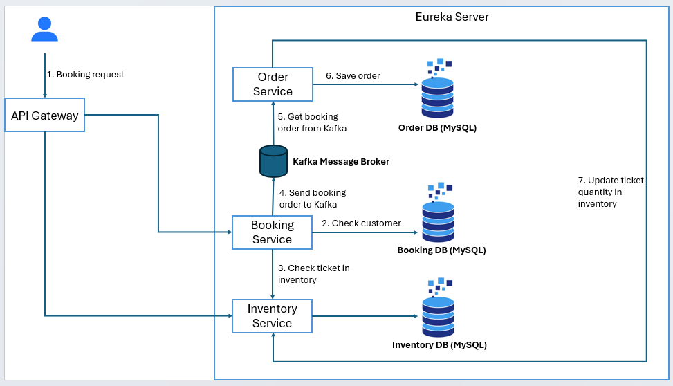

# Kiến trúc hệ thống

## Tổng quan
- **Mục Đích**: Hệ thống microservices cung cấp nền tảng đặt vé, cho phép người dùng tạo, quản lý và đặt vé tham gia các sự kiện.
- **Thành Phần Chính**: Hệ thống bao gồm 7 thành phần chính: API Gateway, Eureka Server, Auth Service, Inventory Service, Booking Service, Order Service và Notification Service.

## Thành Phần Hệ Thống
- **API Gateway** (port 8090): Điểm vào duy nhất cho tất cả các request từ client, xử lý định tuyến và xác thực JWT.
- **Eureka Server** (port 8761): Cung cấp dịch vụ khám phá và đăng ký service.
- **Auth Service** (port 8085): Xác thực người dùng, cấp phát và xác thực JWT access/refresh token.
- **Inventory Service** (port 8082): Quản lý thông tin sự kiện và địa điểm tổ chức sự kiện.
- **Booking Service** (port 8081): Quản lý thông tin người dùng và xử lý yêu cầu đặt vé.
- **Order Service** (port 8083): Xử lý yêu cầu đặt vé và cập nhật số lượng vé sự kiện.
- **Notification Service** (port 8086): Gửi email thông báo đặt vé và đăng ký tài khoản thành công.

## Health Check

Tất cả các service đều expose endpoint:

```
GET /health
Response: { "status": "ok" }
```

## Giao Tiếp
- **REST APIs**: Các service giao tiếp với nhau chủ yếu thông qua REST APIs.
- **Kafka**: Giao tiếp bất đồng bộ giữa Booking Service → Order Service và Booking/Order Service → Notification Service.
- **Mạng Nội Bộ**: Các service giao tiếp qua Docker network `ticket-network` trong môi trường containerized.

## Luồng Dữ Liệu
1. Người dùng gửi yêu cầu đặt vé tới hệ thống thông qua API: `/api/v1/booking`.
2. API Gateway xác thực JWT token bằng cách gọi Auth Service.
3. Request được điều hướng tới Booking Service.
4. Booking Service kiểm tra người dùng hợp lệ.
5. Booking Service gọi Inventory Service để kiểm tra thông tin vé và số lượng còn lại.
6. Booking Service gửi yêu cầu đặt vé tới Kafka topic `booking`.
7. Order Service nhận và xử lý message từ Kafka.
8. Order Service lưu order vào DB.
9. Order Service gọi Inventory Service để cập nhật số lượng vé.
10. Notification Service nhận sự kiện từ Kafka và gửi email xác nhận tới người dùng.

## Kafka Topics

| Topic                | Producer        | Consumer(s)                    |
|----------------------|-----------------|-------------------------------|
| `booking`            | Booking Service | Order Service                  |
| `register_success`   | Booking Service | Notification Service           |
| `buy_ticket_success` | Order Service   | Notification Service           |

## Diagram
.

## Khả Năng Mở Rộng Và Chịu Lỗi
- **Khả Năng Mở Rộng Ngang**: Mỗi service có thể được mở rộng độc lập bằng cách triển khai nhiều instance.
- **Khám Phá Dịch Vụ**: Eureka Server tự động phát hiện các instance mới của service.
- **Cân Bằng Tải**: API Gateway và Eureka Client thực hiện cân bằng tải giữa các instance service.
- **Circuit Breaker**: API Gateway sử dụng Resilience4j với cấu hình circuit breaker, retry và time limiter.
- **Khả Năng Chịu Lỗi**: Nếu một service gặp sự cố, các service khác vẫn có thể hoạt động với chức năng hạn chế.
- **Tự Phục Hồi**: Các service tự động đăng ký lại với Eureka Server khi khởi động lại sau lỗi.